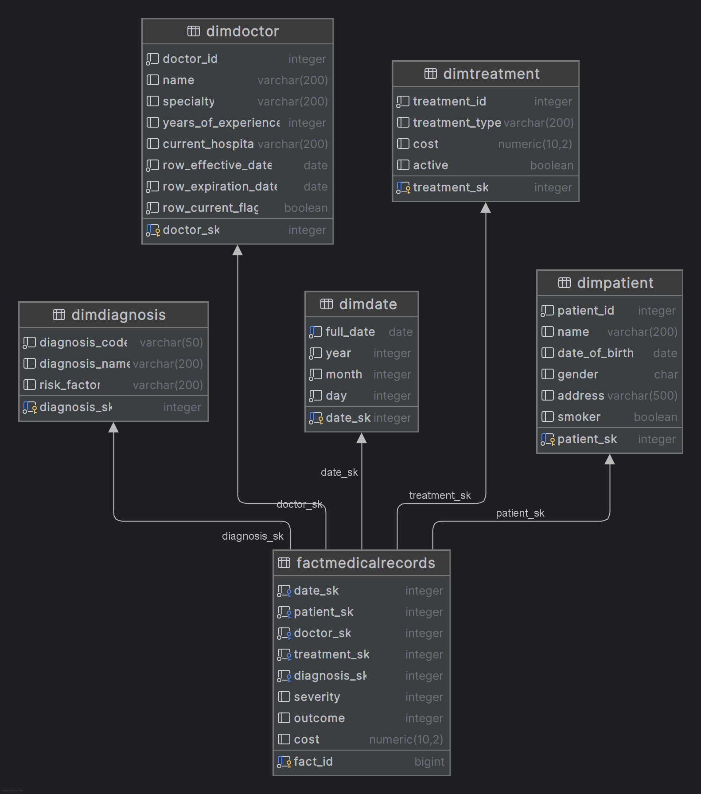

# Projeto Data Warehouse: Análise de Atendimentos em Saúde Pública

Este projeto apresenta a modelagem, implementação e análise de um Data Warehouse (DW) utilizando o esquema estrela. O objetivo é fornecer uma solução analítica para os dados de atendimentos médicos provenientes de um sistema OLTP.

---

## 1. Esquema Estrela

O esquema estrela é composto por:
- **Tabela de Fatos**:
  - `FactMedicalRecords`: Registra os atendimentos médicos, incluindo métricas como custo, severidade e resultado.
- **Tabelas de Dimensões**:
  - `DimDate`: Dimensão de tempo.
  - `DimPatient`: Informações dos pacientes.
  - `DimDoctor`: Informações dos médicos (com histórico via SCD Tipo 2).
  - `DimTreatment`: Detalhes dos tratamentos.
  - `DimDiagnosis`: Diagnósticos e fatores de risco.

### Diagrama do Esquema Estrela

 <!-- Substitua pelo caminho da imagem -->

---

## 2. Processo ETL

O processo ETL foi dividido em três etapas:

### **2.1 Extração**
Os dados foram extraídos das seguintes tabelas do sistema OLTP:
- `patients`: Informações dos pacientes.
- `medical_records`: Atendimentos médicos.
- `doctors`: Informações dos médicos.
- `treatments`: Tipos de tratamentos.
- `diagnoses`: Diagnósticos disponíveis.

### **2.2 Transformação**
Foram aplicadas as seguintes transformações:
- Substituição de chaves naturais por **Surrogate Keys (SK)** para garantir unicidade e consistência.
- Implementação de **Slowly Changing Dimensions (SCD Tipo 2)** na tabela `DimDoctor` para rastrear mudanças nos médicos.
- Normalização de datas em `DimDate`.
- Conversão e mapeamento dos dados para o formato do DW.

### **2.3 Carregamento**
Os dados transformados foram inseridos no DW, preenchendo as dimensões e a tabela de fatos.

---

## 3. Consultas SQL e Resultados

As consultas SQL utilizadas estão disponíveis no arquivo `dw_consult.sql`.

### **Consulta 1**
 <!-- Substitua pelo caminho da imagem -->

### **Consulta 2**
 <!-- Substitua pelo caminho da imagem -->

### **Consulta 3**
 <!-- Substitua pelo caminho da imagem -->

---

## 4. Justificativa

### **4.1 Uso de SCD**
- Implementado na `DimDoctor` para rastrear mudanças no histórico de médicos, como mudança de hospital. Cada registro tem:
  - `row_effective_date`: Data de início da validade.
  - `row_expiration_date`: Data de término da validade.
  - `row_current_flag`: Indica se o registro é atual.

### **4.2 Uso de Surrogate Keys**
- Chaves substitutas foram utilizadas em todas as dimensões para:
  - Garantir unicidade.
  - Evitar dependência de chaves naturais.
  - Melhorar o desempenho nas consultas.

### **4.3 Métricas Aditivas**
- `Cost`: Métrica aditiva utilizada para somar o custo total dos tratamentos.
- A soma foi aplicada na tabela de fatos (`FactMedicalRecords`) para análises financeiras.

---

## 5. Conclusão
O projeto demonstrou a criação e utilização de um Data Warehouse em esquema estrela, incluindo a integração de um processo ETL robusto e consultas analíticas que respondem a perguntas relevantes no contexto de saúde pública.
